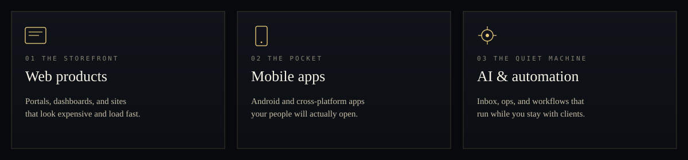
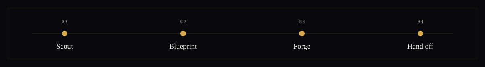
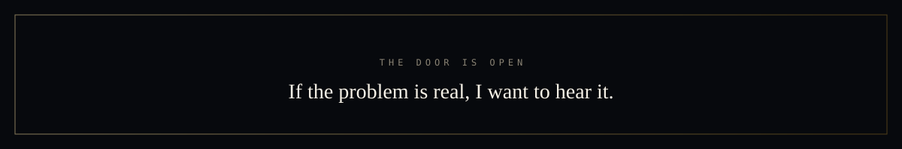

  

 

Most GitHub pages are a résumé in a tuxedo.

This one is a **working table**. I take a messy brief — a half-sketched app, a spreadsheet that secretly runs the company, a process nobody wants to touch — and turn it into software a customer can feel.

I am Donovan Hunt. Independent. Full-stack. I build for people who need the thing **live**, not admired.

 

  

 

<table>
  <tr>
    <td width="50%" valign="top">

### I say yes when

- You need a product a stranger can use without a tour
- The first version has to look like you meant it
- You want one person who can hold web, mobile, and automation
- You’d rather see progress on Friday than a 40-page deck on Monday

    </td>
    <td width="50%" valign="top">

### I say no when

- You want the cheapest pair of hands, not a partner
- The problem is still a vibe and nobody owns the outcome
- You need a team of twelve yesterday
- You want it “quick and dirty” and also “never break”

    </td>
  </tr>
</table>

 

  

**Scout** — we name the user, the win, and the date.  
**Blueprint** — you get a plain-language scope, cost, and what will *not* be in v1.  
**Forge** — you see the product moving, not a black box.  
**Hand off** — working software, a short map of how it runs, and a clean next step.

<strong>What the first week actually feels like</strong>

 

Day 1–2: I pressure-test the idea until the must-haves fit on one page.  
Day 3–4: you see a thin slice — a screen, a flow, or a working stub — so we argue about the real thing.  
Day 5: we lock the path or we stop early. I would rather end a bad fit in a week than drag it for a quarter.

---

### On the bench

Work I’m putting in public so you can judge the craft, not the bio.

| Signal | Piece | Why it exists |
| :---: | --- | --- |
| `WEB` | **Pulseboard** | A dashboard a client can navigate without me on a call |
| `MOBILE` | **Taskflow** | An Android/Kotlin app that feels finished, not demoed |
| `AI` | **Inbox Pilot** | Automation that steals the boring hours back |

These land here as they ship. If you want the private version of this energy on *your* product, start a conversation.

---

### The kit

I don’t worship a stack. I pick what will still be kind to you in a year.

`TypeScript` · `React` · `Node` · `Kotlin` · `Android` · `Python` · `APIs` · `automation` · `AI wired into real workflows`

---

  

 

Open an **issue** on this repo. Tell me what broke, what you wish existed, or the date it has to be real.

I read them. If it’s a fit, we talk. If it isn’t, I’ll say so — that is also a kindness.
